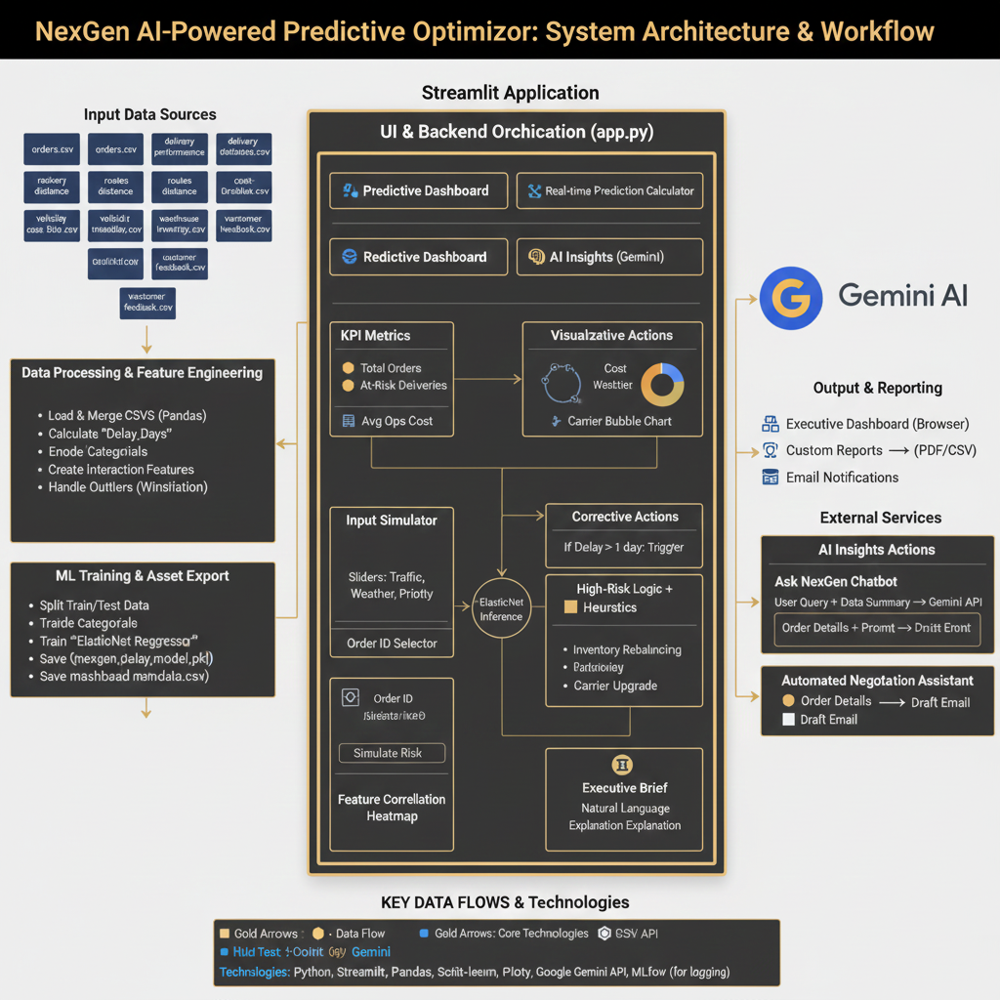

# NexGen Logistics | AI-Powered Predictive Optimizer

**An Intelligent Logistics Dashboard for the Innovation Challenge**

NexGen Logistics is a comprehensive predictive analytics platform designed to minimize delivery risks, optimize costs, and automate managerial decisions using **Google Gemini AI**.

 *(Assuming logo exists, or you can add a screenshot here)*

---

## 🚀 Key Features

### 1. 📊 Predictive Control Tower
*   **KPI Dashboard**: Real-time tracking of Total Orders, At-Risk Shipments, and Avg Operational Costs.
*   **Advanced Visuals**:
    *   **Network Delay Map (3D)**: Visualize route bottlenecks in 3D.
    *   **Cost Sunburst**: Deep dive into operational expenses.
    *   **Stock Health Grid**: Clean comparison of Inventory vs. Reorder Levels.

### 2. 🧪 Real-time Simulator (What-If Analysis)
*   **Scenario Testing**: Adjust Traffic, Weather, and Priority sliders to simulate future risks.
*   **Prescriptive Engine**: Automatically suggests:
    *   **Stock Redirection**: Finds the nearest warehouse with surplus stock.
    *   **Carrier Upgrade ROI**: Calculates if switching to Air Freight saves money compared to penalty costs.
*   **Gemini Managerial Summary**: Generates an executive brief justifying the corrective action.
*   **Auto-Drafted Emails**: Creates a downloadable PDF directive for carriers instantly.

### 3. 🧠 AI Insights ("Ask NexGen")
*   **Data Analyst Agent**: Chat with your data! Ask questions like *"Why are deliveries to Mumbai delayed?"* and get data-backed answers.
*   **Negotiation Assistant**: Select an at-risk order, and the AI drafts a tough negotiation email to the carrier.

### 4. 🌐 Multi-Data Ingestion
*   Seamlessly merges **7 different datasets**:
    *   `orders.csv` (Master)
    *   `delivery_performance.csv` & `costs.csv`
    *   `routes.csv`, `fleet.csv`, `inventory.csv`, `feedback.csv`

---

## 🛠️ Technology Stack
*   **Frontend**: Streamlit (Python)
*   **AI Model**: Google Gemini 2.5 Flash (`google-genai` SDK)
*   **Machine Learning**: Scikit-Learn (Rando Forest Regressor, Elastic Net via `joblib`)
*   **Visualization**: Plotly Express & PyDeck (3D Maps)
*   **Reporting**: FPDF (PDF Generation)

---

## ⚙️ Installation & Usage

### Prerequisites
*   Python 3.9+
*   Google Gemini API Key

### Step 1: Clone & Setup Environment
```bash
# Create a virtual environment
python -m venv venv

# Activate the virtual environment
# Windows:
.\venv\Scripts\activate
# Mac/Linux:
source venv/bin/activate

# Install dependencies
pip install -r requirements.txt
```

### Step 2: Run the Application
```bash
streamlit run app.py
```

### Step 3: Configure
1.  Enter your **Gemini API Key** in the sidebar.
2.  The app will auto-load data from the `NexGen_Logistics/` folder.
3.  Navigate through the 4 tabs to explore!

---

## 📂 Project Structure
*   `app.py`: Main application logic (Frontend + Backend).
*   `nexgen_delay_model.pkl`: Pre-trained risk prediction model.
*   `NexGen_Logistics/`: Folder containing the 7 sample CSV datasets.
*   `assets/`: Logos and static images.
*   `requirements.txt`: Dependency list.

---

> *Built for the NexGen Logistics Innovation Challenge by [Your Name/Role]*
